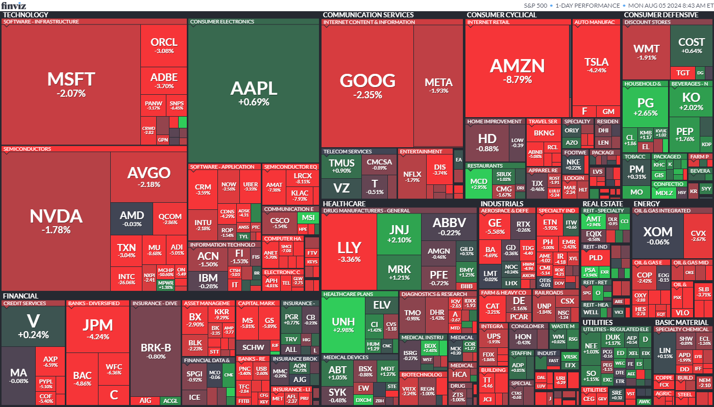

## 주요 뉴스 요약

1. **미국 7월 일자리 증가율 둔화 및 실업률 상승**  
   7월 비농업 일자리가 11만 4,000개 증가하며 일자리 증가율이 예상보다 둔화하였고, 실업률은 4.3%로 상승하여 2021년 10월 이후 최고치를 기록하며 주가가 하락했습니다.

2. **버크셔 해서웨이, 애플 지분 절반가량 매각**  
   워렌 버핏의 버크셔 해서웨이가 애플 지분의 49% 이상을 매각하며, 2분기 말 기준 애플 지분 가치가 842억 달러에 달한다고 발표했습니다. 이에 따라 버크셔는 총 750억 달러 이상의 주식을 매각하고 현금 보유액이 2,770억 달러를 기록했습니다.

3. **미국 경제 전망 악화로 채권 수요 증가**  
   미국 경제 전망의 악화 우려가 채권 자산에 대한 수요를 자극하며 글로벌 채권이 손실을 회복했습니다. 트레이더들은 연준의 긴급 금리 인하 확률을 60%로 높이며 10년물 채권수익률이 1년 만에 최저치를 기록했습니다.

4. **크라우드스트라이크, 델타항공 항공편 취소 책임 부인**  
   크라우드스트라이크는 델타항공의 수천 건의 항공편 취소에 대한 책임을 부인하며, IT 장애가 발생했을 때 델타항공이 지원을 거부했다고 주장했습니다. 델타항공의 CEO는 서비스 중단으로 약 5억 달러의 손실을 보았다고 밝혔으며, 크라우드스트라이크의 변호사는 델타의 소송 위협이 잘못된 주장이라고 반박했습니다.

5. **인텔, 대규모 감원 및 배당 중단 발표 후 주가 급락**  
   인텔은 약 17,000명의 직원을 감원하고 배당을 중단한다고 발표하며 주가가 26% 하락했습니다. 인텔은 100억 달러를 절약하기 위해 인력을 조정할 계획이며, CEO는 시장 상황에 맞춰 재정 범위를 조정해야 한다고 언급했습니다.

6. **절반쯤 지나온 실적 발표 기간**  
   디즈니, 일라이 릴리 등 S&P 500에 속한 70개 이상의 기업이 이번 주에 분기 실적을 발표할 예정입니다. 현재까지 약 78%의 기업이 예상치를 초과하는 성과를 보이며, 전년 동기 대비 S&P 500 지수의 2분기 이익 증가율은 11%를 넘을 것으로 예상됩니다.

7. **경제 지표 부진으로 다우존스, 최대 낙폭 기록**  
   예상보다 부진한 경제 지표로 인해 다우존스 산업평균지수가 5월 이후 최대 낙폭을 기록했습니다. 과거에는 경제에 대한 나쁜 소식이 금리 인하 기대감으로 주식 시장에 긍정적으로 작용했지만, 현재는 반대의 상황이 나타나고 있습니다. 제롬 파월 연준 의장은 9월 금리 인하 가능성을 시사했으나, 일부 전문가들은 완화 조치가 지연되고 있다고 우려하고 있습니다.

8. **주식 시장이 순환하고 있습니다.**  
   기술주와 임의소비재주는 큰 타격을 입었지만, 채권 수익률 하락으로 인해 유틸리티와 부동산 기업은 S&P 500에서 가장 좋은 성과를 냈습니다. 웰스 얼라이언스의 에릭 디턴은 고용 시장 냉각으로 금리가 하락할 것이라며, 배당금을 지급하는 기업의 매력이 높아지고 있다고 설명했습니다.

## 주요 변화

[AMZN](https://finance.yahoo.com/quote/AMZN/) -8.78%  
[INTC](https://finance.yahoo.com/quote/INTC/) -26.06%  
[NVDA](https://finance.yahoo.com/quote/NVDA/) -1.78%  
[AAPL](https://finance.yahoo.com/quote/AAPL/) +0.69%  
[GOOG](https://finance.yahoo.com/quote/GOOG/) -2.35%  
[GOOGL](https://finance.yahoo.com/quote/GOOGL/) -2.40%  
[MSFT](https://finance.yahoo.com/quote/MSFT/) -2.07%  
[AMD](https://finance.yahoo.com/quote/AMD/) -0.03%  
[CVX](https://finance.yahoo.com/quote/CVX/) -2.67%  
[XOM](https://finance.yahoo.com/quote/XOM/) -0.06%

## 주요 지수 요약

> 미국 증시

- **Nasdaq** : 16,776.16 (-2.43%)
- **S&P 500** : 5,346.56 (-1.84%)
- **Dow 30** : 39,737.26 (-1.51%)
- **Russel 2000** : 2,109.31 (-3.52%)

> 채권

- **미국 10년물 채권 금리** : 3.792 (-4.76%)
- **미국 2년물 채권 금리** : 3.874 (-6.80%)
- **미국 장단기 금리차(T10Y2Y)** : -0.08

> 금

- **금** : 2,486.10 (+0.21%)

> 원유/원자재

- **WTI 원유** : 74.14 (-2.84%)
- **천연 가스** : 1.978 (+0.51%)

> 공포 탐욕

- **FEAR** : 27
- **VIX** : 23.39 (+25.82%)

## 지난 주요 경제 일정

|           이벤트            | 중요도 |   실제   | 예측  | 이전  |
| :-------------------------: | :----: | :------: | :---: | ----- |
|    비농업고용지수 (7월)     | ⭐⭐⭐ | 114k(▼)  | 175k  | 179k  |
|        실업률 (7월)         | ⭐⭐⭐ | 4.3%(▲)  | 4.1%  | 4.1%  |
| 평균 시간당 임금 MoM (7월)  |  ⭐⭐  | 0.2%(▼)  | 0.3%  | 0.3%  |
|    평균 시간당 임금 YoY     |  ⭐⭐  | 3.6%(▼)  | 3.7%  | 3.8%  |
| 민간 비농업 고용 명부 (7월) |  ⭐⭐  |  97k(▼)  | 148k  | 136k  |
|        참여율 (7월)         |  ⭐⭐  | 62.7%(▲) | 62.6% | 62.6% |

## 다가오는 주요 경제 일정

|           이벤트            | 중요도 | 예측 | 이전 |
| :-------------------------: | :----: | :--: | :--: |
|  S&P 글로벌 종합 PMI (7월)  |  ⭐⭐  | 55.0 | 54.8 |
| S&P 글로벌 서비스 PMI (7월) |  ⭐⭐  | 56.0 | 55.3 |
|    ISM 서비스 PMI (7월)     | ⭐⭐⭐ | 51.4 | 48.8 |

## 실적 발표 예정

> 개장 전

버크셔 해서웨이(BRK-B)  
타이슨 푸드(TSN)

> 마감 후

CSX(CSX)  
팔란티어 테크놀로지스(PLTR)  
리얼티 인컴(O)  
윌리엄스 컴퍼니즈(WMB)  
사이먼 프로퍼티 그룹(SPG)  
원오케이(OKE)  
다이아몬드백 에너지(FANG)

- Sources: CNBC, Yahoo Finance, Reuters, MarketWatch, Investing.com, Finviz, Bloomberg, ...
