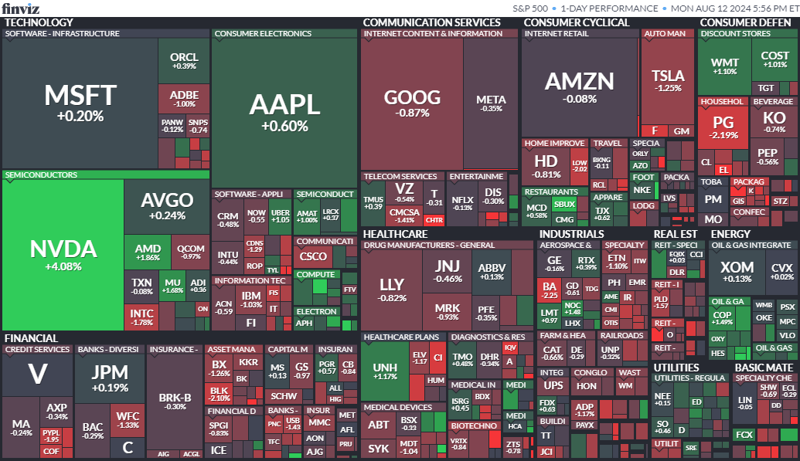

## 주요 뉴스 요약

1. **미국 증시, 주요 경제지표 앞두고 혼조세로 마감**  
   월요일 미국 증시는 주요 경제지표 발표를 앞두고 혼조세로 마감했습니다. S&P 500 지수는 보합세를 보였고, 기술주 중심의 나스닥 종합지수는 약 0.2% 상승했습니다. 반면 다우존스 산업평균지수는 약 0.4% 하락하며 150포인트 미만으로 떨어졌습니다. 월가는 불안과 초조함 속에서 한 주를 마무리하고 새로운 한 주를 맞이하고 있습니다. 전략가들은 이러한 변동성이 지속될 것으로 전망하며, 이번 주에도 많은 기회가 있을 것이라고 언급했습니다. [[원문]](https://finance.yahoo.com/news/stock-market-today-nasdaq-edges-higher-dow-drops-as-investors-await-key-signals-on-inflation-economy-200123816.html)

2. **소비자 인플레이션 기대치, 3년 전망 최저치 기록**  
   월요일 뉴욕 연방 준비 은행의 보고서에 따르면, 소비자들은 7월에 인플레이션이 향후 몇 년 동안 덜 문제가 될 것이라는 확신이 커졌으며, 3년 전망이 새로운 최저치를 기록했습니다. 최신 월간 소비자 기대치 설문 조사에 따르면 응답자들은 인플레이션이 내년에는 상승세를 유지하겠지만, 그 이후 몇 년 동안 하락할 것이라고 보고하고 있습니다. 조사 결과에 따르면, 3년 후 인플레이션에 대한 소비자들의 기대치는 6월보다 0.6%포인트 하락한 2.3%로, 이는 2013년 6월 이후 가장 낮은 수치입니다. [[원문]](https://www.cnbc.com/2024/08/12/three-year-inflation-outlook-hits-record-low-in-new-york-fed-consumer-survey.html)

3. **엘론 머스크의 정치적 입장 변화와 테슬라의 보조금 활용 전략**  
    최근 엘론 머스크는 도널드 트럼프를 지지하며 "드릴, 베이비, 드릴"과 같은 발언을 통해 전기차 보조금 문제에 대한 상반된 입장을 드러냈습니다. 머스크는 보조금을 점차 무시하는 모습을 보였지만, 테슬라는 여전히 미국 정부의 보조금을 적극적으로 활용해 빠른 성장을 이루어왔습니다.
   머스크는 최근 몇 년 동안 트럼프와 공화당의 수사를 수용하는 경향을 보였으나, 동시에 민주당이 옹호하는 혜택을 위한 로비 활동도 계속하고 있습니다. [[원문]](https://www.reuters.com/world/us/musk-embraces-trump-scorns-subsidies-tesla-still-lobbies-us-benefits-2024-08-12/)

4. **홈디포, 금리 인하 기대 속 또 다른 분기 실적 부진 예상**  
   홈디포는 높은 금리와 소비자들의 지출 감소로 인해 또 한 번의 부진한 분기 실적을 발표할 것으로 보입니다. 화요일 발표될 예상 실적에 따르면, 홈디포는 전년 대비 1.64% 증가한 436억 2천만 달러의 매출과 2.61% 하락한 4.53달러의 조정 주당 순이익을 기록할 것으로 예상되며, 동일 매장 매출은 2.39% 감소할 것으로 보입니다. 이로 인해 홈디포는 7분기 연속 마이너스 매출 성장을 기록하게 됩니다. [[원문]](https://finance.yahoo.com/news/home-depot-expected-to-see-another-quarter-of-soft-earnings-as-potential-rate-cut-comes-into-view-190619336.html)

5. **로빈후드, 목표치 상향 조정**  
   최근 로빈후드의 주가는 7월 고점 대비 약 25% 하락했지만, Piper Sandler의 애널리스트 Patrick Moley는 매수 기회를 보고 있습니다. 그는 고객에게 보낸 메모에서 로빈후드의 주가를 중립에서 비중확대로 상향 조정하며, 곧 몇 가지 매력적인 촉매제가 나타날 것이라고 밝혔습니다. 현재 미국 성인의 약 10%가 로빈후드 계좌를 보유하고 있지만, 이 계좌에는 미국 내 소매 자산 약 65조 달러 중 0.3% 미만만 예치되어 있습니다. 그는 "향후 20년 동안 이러한 자산의 대부분이 베이비붐 세대와 그 자녀에게 넘어갈 것으로 예상된다"며, 이로 인해 젊은 세대의 '자기 주도적' 투자 선호도가 높아지는 가운데 로빈후드가 혜택을 받을 것으로 보입니다. [[원문]](https://www.marketwatch.com/story/how-robinhood-can-win-a-bigger-piece-of-the-65-trillion-pie-of-investable-assets-097ae150?mod=home-page)

6. **미국 주택 시장, 50조 달러 가치 돌파 임박**  
   레드핀에 따르면, 미국 주택 시장은 현재 사상 최고치에 도달하며 50조 달러의 가치를 기록하기 직전입니다. 주택 시장의 수요와 공급 불균형이 지속되면서 주택 가격이 급격히 상승하고 있습니다. 부동산 리스팅 사이트의 보고서에 따르면, 올해 6월 기준 미국 전체 주택의 가치는 49조 6천억 달러에 달하며, 이는 작년 대비 3조 1천억 달러 상승한 수치입니다. 전문가들은 내년 6월까지 50조 달러를 돌파할 것으로 예상하고 있습니다. [[원문]](https://finance.yahoo.com/news/us-housing-market-verge-hitting-140841398.html)

7. **일본 시장의 평온함과 글로벌 경제의 긴장감**  
   월요일의 시장 평온함은 일본의 공휴일로 인해 폭풍의 중심에 있는 일본의 닛케이 지수와 엔화에 영향을 받았을 가능성이 있습니다. 그러나 투자자들은 수요일에 발표될 미국 소비자물가지수(CPI)를 주목하고 있습니다. 이 발표는 인플레이션에 대한 중요한 지표가 될 것이며, 현재 시장은 지나치게 하락한 CPI 수치가 경기 침체에 대한 우려를 키울까 걱정하고 있습니다. 일부 투자자들은 연준이 금리 인하에 너무 늦을 수 있다고 의심하고 있으며, 이는 최근의 부진한 고용 보고서가 시장 매도세의 촉매제 중 하나로 작용한 이유입니다. [[원문]](https://finance.yahoo.com/news/morning-bid-newfound-market-calm-214936291.html)

8. **일라이 릴리 주식, 채권 매각 소식에 하락 마감**  
   일라이 릴리 주가는 월요일 애널리스트의 업그레이드 소식이 전해진 후 상승세를 보였으나, 50억 달러 규모의 채권 매각 소식이 알려진 뒤 하락세로 마감했습니다. 블룸버그의 보도에 따르면, 일라이 릴리는 모픽 홀딩 인수 자금을 조달하기 위해 50억 달러의 채권을 매각할 계획이라고 밝혔고, 이는 주가에 영향을 미쳤습니다. 결과적으로, 회사의 주가는 월요일 세션에서 1% 미만 하락으로 마감했습니다. [[원문]](https://finance.yahoo.com/news/eli-lilly-stock-finishes-lower-214916768.html)

9. **경제 데이터 발표 전 월가의 엇갈린 반응, CPI 주목**
   투자자들은 수요일에 발표될 미국 소비자 물가 지수(CPI)와 소매업체 실적을 기다리며 쇼핑객의 수요를 평가하고 있습니다. 7월 헤드라인 인플레이션은 6월보다 0.2% 상승할 것으로 예상되지만, 전년 대비로는 3%로 변동이 없을 것으로 보입니다. 목요일에 발표될 7월 미국 소매판매 수치는 미미한 성장세를 보일 것으로 보이며, 투자자들은 이 데이터가 소비 둔화와 잠재적 경기 침체에 대한 우려를 재점화할 수 있다고 예상하고 있습니다. [[원문]](https://www.investing.com/news/economy-news/futures-muted-ahead-of-datapacked-week-with-cpi-in-focus-3565888)

10. **하반기에 데이터 센터 수요 증가를 기대하는 미국 유틸리티 기업들**  
     미국 전력 회사들은 2분기 동안 여러 공급 계약을 체결한 후, 인공지능 붐을 이끄는 데이터 센터의 수요에 대해 낙관적인 전망을 보이며 올해 내내 매출 성장에 대한 시장의 기대를 강화하고 있습니다. 아메리칸 일렉트릭 파워 컴퍼니와 넥스트에라 에너지는 최근 체결된 계약을 통해 다른 기술 회사들의 관심을 강조했습니다.분석가들은 유틸리티 업체들이 의미 있는 매출 성장을 보일 수 있으며, 2년 동안의 실적 부진 이후 장기 성장 목표를 달성하거나 초과 달성할 수 있는 유리한 위치에 있다고 평가하고 있습니다. [[원문]](https://www.investing.com/news/stock-market-news/us-utilities-poised-to-ride-data-center-demand-wave-in-second-half-3567253)

## 주요 변화

[NVDA](https://finance.yahoo.com/quote/NVDA/) +4.08%  
[AMZN](https://finance.yahoo.com/quote/AMZN/) -0.08%  
[TSLA](https://finance.yahoo.com/quote/TSLA/) -1.25%  
[MSFT](https://finance.yahoo.com/quote/MSFT/) +0.19%  
[DIS](https://finance.yahoo.com/quote/DIS/) -0.30%  
[GOOGL](https://finance.yahoo.com/quote/GOOGL/) -0.84%  
[GOOG](https://finance.yahoo.com/quote/GOOG/) -0.87%  
[META](https://finance.yahoo.com/quote/META/) -0.35%  
[KEY](https://finance.yahoo.com/quote/KEY/) +9.10%  
[WMT](https://finance.yahoo.com/quote/WMT/) +1.10%

## 주요 지수 요약

> 미국 증시

- **Nasdaq** : 16,782.57 (+0.22%)
- **S&P 500** : 5,344.39 (+0.00%)
- **Dow 30** : 39,357.01 (-0.36%)
- **Russel 2000** : 2,060.40 (-0.99%)

> 채권

- **미국 10년물 채권 금리** : 3.910 (-0.87%)
- **미국 2년물 채권 금리** : 4.021 (-0.79%)
- **미국 장단기 금리차(T10Y2Y)** : -0.11

> 금

- **금** : 2,511.95 (-0.05%)

> 원유/원자재

- **WTI 원유** : 79.66 (+3.67%)
- **천연 가스** : 2.176 (+1.54%)

> 공포 탐욕

- **EXTREME FEAR** : 24
- **VIX** : 20.71 (+1.67%)

## 지난 주요 경제 일정

|        이벤트        | 중요도 |    실제    |  예측   | 이전   |
| :------------------: | :----: | :--------: | :-----: | ------ |
| 연방 재정 수지 (7월) |  ⭐⭐  | -244.0B(▲) | -254.3B | -66.0B |

## 다가오는 주요 경제 일정 (240813)

|                 이벤트                  | 중요도 | 예측 | 이전 |
| :-------------------------------------: | :----: | :--: | :--: |
|      생산자물가지수(PPI) MoM (7월)      | ⭐⭐⭐ | 0.2% | 0.2% |
| 근원 생산자물가지수(Core PPI) MoM (7월) |  ⭐⭐  | 0.2% | 0.4% |
|          연준 보스틱 총재 연설          |  ⭐⭐  |      |      |

## 실적 발표 예정 (240813)

> 개장 전

홈디포(HD)

> 마감 후

머큐리 시스템즈(MRCY)

- Sources: CNBC, Yahoo Finance, Reuters, MarketWatch, Investing.com, Finviz, Bloomberg, ...
