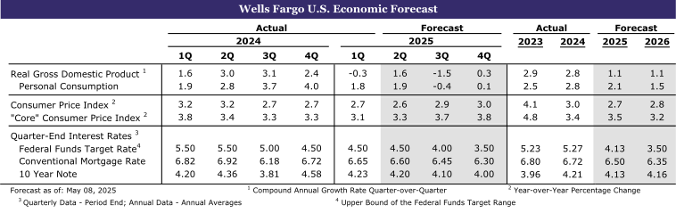

### The old versus the new

<!-- truncate -->

**Summary**

- 오래된 것과 새로운 것(The Old versus the New)
- 국제 지표, 엇갈린 성장과 지속되는 인플레이션 보여줘(International Data Show Mixed Growth and Lingering Inflation)
- 무디스의 신용등급 강등, 재정 현실에 주목(Moody's Downgrade Spotlights Fiscal Reality)
- 관세가 미국 제조업 일자리 부활을 이끌 수 있을까?(Will Tariffs Spur a Resurgence of U.S. Manufacturing Jobs?)

[[원문]](https://wellsfargo.bluematrix.com/docs/html/e158074d-0f92-4a41-8160-c55e877085e0.html)
