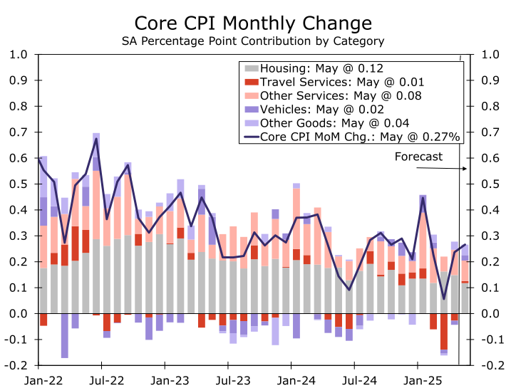

### An orderly slowing, for now

<!-- truncate -->

**Summary**

- 일단은 질서 있는 둔화(An orderly slowing, for now)
- 유럽중앙은행 기준금리 인하, 완만한 완화 기조 유지(European Central Bank Cuts Rates, Maintains Modest Easing Bias)
- 시간이 좀 걸릴 수도(This Might Take a Minute)
- GSE 보전관리 종료의 함의(Implications of a GSE Conservatorship Exit)

[[원문]](https://wellsfargo.bluematrix.com/links2/html/0104545f-d9d4-405f-bbea-e4f57f789bbf)
