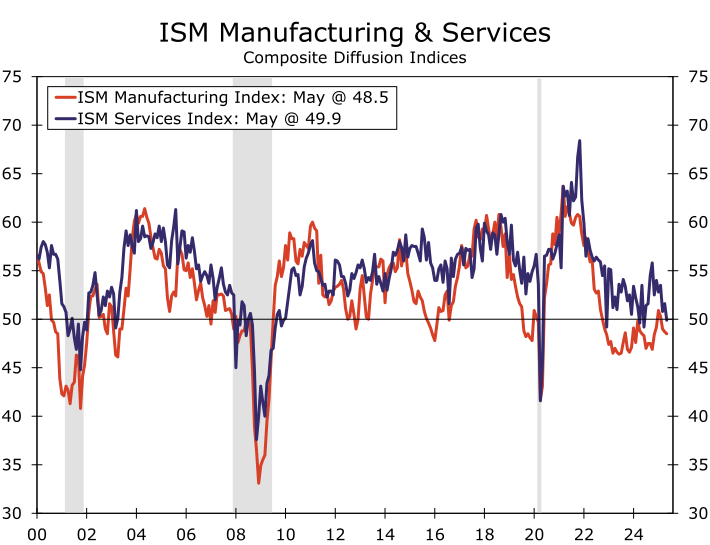

### Stag Before Flation

<!-- truncate -->

**Summary**

- 선 침체, 후 인플레이션(Stag Before Flation)
- 불확실한 성장과 완화된 인플레이션: 글로벌 경제 신호는 여전히 엇갈림(Tentative Growth and Tempered Inflation: Global Economic Signals Remain Mixed)
- “기다릴 수 있는 좋은 위치”("Well Positioned to Wait")
- 모든 것이 겉보기와 달랐다(Everything Was Not As It Seemed)

[[원문]](https://wellsfargo.bluematrix.com/links2/html/59227278-ce82-43d3-98fd-828078df560b)
