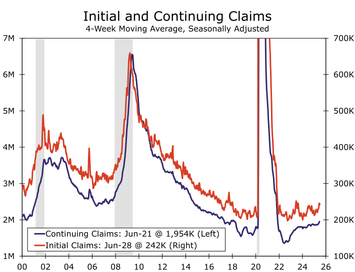

### Perhaps the Key to Economic Happiness Is Low Expectations

<!-- truncate -->

**Summary**

- 경제적 행복의 열쇠는 낮은 기대치일지도(Perhaps the Key to Economic Happiness Is Low Expectations)
- 아시아에서 유럽까지: 기업 심리, 인플레이션 추세, 정책 변화(From Asia to Europe: Business Sentiment, Inflation Trends and Policy Shifts)
- 수요 둔화 속 은행 대출 여전히 긴축적(Bank Lending Remains Tight Amid Softer Demand)
- 아름다운 하나의 법안, 그 끝은?(The One Big Beautiful Bill Endgame)

[[원문]](https://wellsfargo.bluematrix.com/docs/html/8ad1a56b-54ea-48e4-939a-5d2ab9085594.html)
