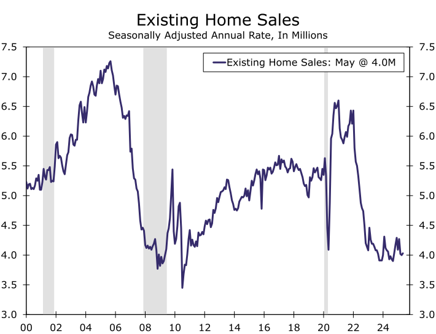

### Economic Data Clears the Bar, but Doesn’t Raise It

<!-- truncate -->

**Summary**

- 경제 지표, 기준은 넘었지만 상향 조정은 없어(Economic Data Clears the Bar, but Doesn’t Raise It)
- 해외 경제에서 엇갈리는 신호(Mixed Signals from Foreign Economies)
- 불에는 불로 맞서다(Fighting Fire with Fire)
- 소비자 신용 지표, 통계 방식 변경으로 흐림(Methodological Changes Cloud Recent Consumer Credit Trends)
- 해외 공급업체, 관세 압박에 저항(Foreign Suppliers Resisting Tariff Pressures)

[[원문]](https://wellsfargo.bluematrix.com/docs/html/c66e7c1f-e74e-436c-b868-89d5362ea841.html)
